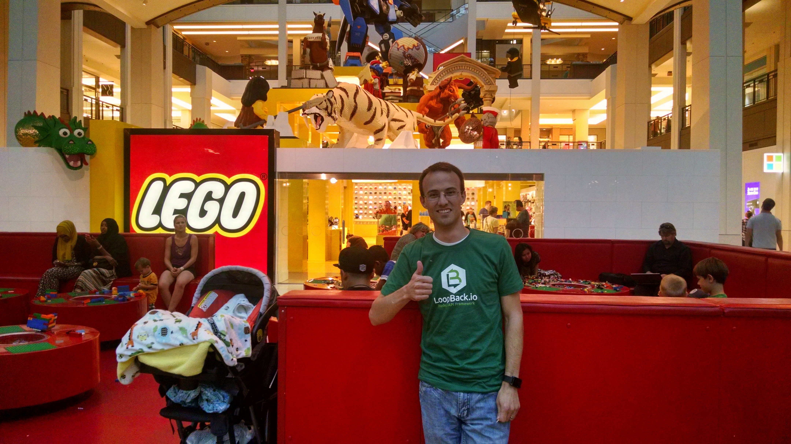
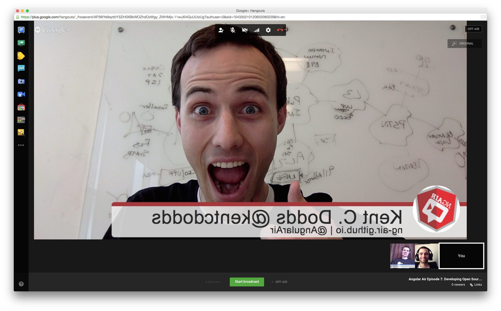
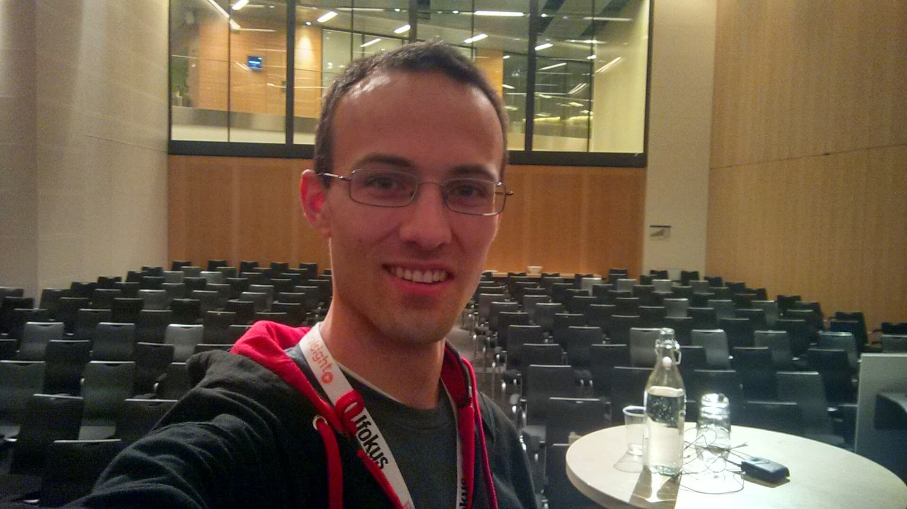

It's been an incredible decade. So much of my life has changed in the last 10
years. I'm going to share a few select highlights from my life in the last 10
years and then talk about some of the things I'm looking forward for the next
decade.

The 2010s were the years that I went through college, completely unaware what I
would do for a career and transitioned into the real world as a Software
Engineer (something I never thought I would do) and husband/father (something I
always wanted to do). I don't think any decade will be as impactful to the rest
of my life.

I've told parts of this story a few times on [a few podcasts](/appearances) and
on [my AMA](https://kcd.im/ama):

- [This Developing Story](https://developingstory.netlify.com/tds-56-kent-c-dodds)
- [Developer on Fire](http://developeronfire.com/podcast/episode-239-kent-c-dodds-nice-and-inclusive)
- [Tyler McGinnis's podcast](https://tylermcginnis.com/podcast/kentcdodds/)
- [NADCAST.07](https://www.youtube.com/watch?v=FEeL_c2wtpU)

Disclaimer: My decade's experiences are unique to me and subject to all the
privilege of my life, luck, chance, hard work, and things working out despite
myself. Hopefully if this isn't helpful, it's at least as entertaining as an
episode of a mediocre Netflix series.

Warning: I can be a little long-winded.

Let's get started!

## 2010

In 2010, I was still a missionary for the Church of Jesus Christ of Latter-Day
Saints. I can't adequately describe to you the impact that 2 years impacted my
life, so I won't even try. Just know that almost every good thing about myself
can be tied to something that I learned during the two years I served and taught
God's children in the Missouri Independence Mission.

I returned home from my mission in February and was ready to start back up at
school at [BYU](https://byu.edu) in the Spring. I tried and failed to get a job
for that time, so I started my own "company" digitizing people's collection of
DVDs and CDs:

I didn't make a lot of money, but it gave me something productive to do while I
waited for school.

Once I got back to school, I met a lot of new friends (including my future
wife), but I was concerned with how many people were ignoring each other, so I
started a little group/club called
[iSayHi](https://www.facebook.com/groups/121823174529508/) which was a
commitment to friendliness
([here's the Provo edition](https://www.facebook.com/groups/146971872002487/)).

It didn't get too big, but I like to think that we made our little corner of the
world a better place!

I got a job at the BYU Conference Center as an A/V technician. The work was not
bad and the people were awesome.

I also got involved in the school American Sign Language club (ASL). I was never
very good at ASL and unlike everyone else in the club I wasn't taking any ASL
classes, but I learned a bit before my mission and used it during my mission to
teach the gospel to some deaf people I met. It was a good time.

Before my mission, I had been in the
[BYU Men's Chorus](https://pam.byu.edu/ensembles/mens-chorus/). I joined back up
in 2010 as a Tenor and was also part of leadership of the group.

2010 was also the year that I realized Electrical Engineering wasn't going to
work out for me because I was pretty terrible at math. So I bounced around
advisor's offices until I landed in Accounting... Ugh... Don't worry, more on
this next year.

## 2011

In 2011, I was pretty into Ultimate Frisbee.

At the end of 2010, I left the BYU Conference Center and joined up as a
"Computer Lab Technician" which basically meant I sat all day at a computer in
the "Computer Lab" (just a room with school-provided computers for students to
use) and every 15 minutes I walked around to make sure nobody needed any help
with Microsoft Office and ensured the printer had paper in it. It was a cushy
job and I spent most of my time working on homework.

My wife and I got married in summer of 2011. It's been wonderful!

Luckily I figured out that Accounting that wasn't going to work for me either
and by the beginning of 2011 I decided to switch to Information Systems which
went much better. I worked hard and made it into the Information Systems program
which I started in the Fall semester. It was incredibly intense.

When I started in the program, I also left my cushy Computer Lab Technician job
for one that I thought could be more in line with what I wanted to do for a
career. I started as an intern at the non-profit organization called the
[More Good Foundation](https://www.moregoodfoundation.org/) and they gave me the
task of uploading a TON of church videos to our YouTube channels. It was
monkey-work to be honest. Super boring stuff.

At the same time, I was in a Java programming class at school and I realized
that [Handbrake](https://handbrake.fr/) (the software I was using to rip the
DVDs and process the videos) had this thing called a CLI and I thought I could
probably generate the CLI string with a computer program I could write and speed
up my process considerably. So my boss said I could try to make that happen and
it worked! Then I had time to do even more and eventually we started just
downloading videos (with permission) from [lds.org](https://lds.org) and
uploading them to YouTube. I worked out how to make all that happen
automatically. In 13 languages. It was thousands of videos that my program
automatically downloaded and re-uploaded, leveraging the SEO work the church had
done on the official site.

If you're curious what kind of videos these were,
[here's a personal favorite](https://www.churchofjesuschrist.org/study/general-conference/2009/04/none-were-with-him).
I'm pretty sure the church decided to start putting the videos on YouTube
themselves so the More Good Foundation took theirs down because I can't find the
ones that I uploaded, but it was pretty cool. The CEO even had me present my
software to the board of donors. It was a pretty proud moment for me. I didn't
know it yet, but I was turning into a software developer.

That year, all of my classmates and I were frantically looking for internships
for the summer and I was struggling really hard to find one. Most of my friends
had secured internships and I had failed to get one despite trying several
interviews.

I interviewed at the Church of Jesus Christ of Later-Day Saint's Information and
Communications Department (it's an organization with thousands of employees).
The person interviewing me said that he didn't think I fit for the job he was
hiring for, but he wanted me to get a position at the organization so he hooked
me up with another manager who offered me a position as a Quality Assurance
intern.

A few months later, I was presenting a project that I worked on with a team of
people to some guest judges from the Church. I went a little bit above and
beyond with my part of the project and one of the judges was really impressed.
He found out that I was interning at the Church and told me he wanted me to
transition to his organization. I was flattered and thrilled, because I wasn't
super excited about doing QA and he was offering me an opportunity to work in
his org as a Business Intelligence Engineer (which is what I thought I wanted to
do).

## 2012

In 2012, I joined the BYU
[Association for Information Systems](https://aisnet.org/) chapter leadership. I
spent the rest of my school experience as part of the leadership of that group
(eventually I was co-president) and that was a rewarding experience. Our chapter
coordinated sponsorships from over a dozen companies who hosted events for our
students a few times a month. It was an awesome experience.

My internship at the Church went super well. When I started, I was still not
convinced I wanted to be a software engineer. I thought I wanted to do business
intelligence. I learned about denormalized database schemas optimized for fast
reads and answering business questions. I learned about ETL processes and tools.
It was cool, but my mentor asked me to help him work on a Java program he had
written to automate emailing reports and after finishing that simple task, I
found myself drawn to finding more and more things that I could do to improve
it. During this time I finally realized how much I enjoyed writing software to
solve problems.

When my summer internship wrapped up, my boss asked if I'd like to stay on
part-time and I did for a few months, but eventually I got a call from a
recruiter at [Domo](https://www.domo.com/) and they told me that I could write
software as part of my job description. They also offered free snacks, meals,
and a shorter commute. So I traded my collard shirts and khakis for a developer
shirt, shorts, and flip-flops. Actually, they hired me to write automated tests
for their Java web endpoints, but that didn't last long before I joined the
frontend JavaScript team.

I had no idea how good this would be for me. I worked with some of the smartest
people in the business. I learned a TON from them. I'll always be grateful to
[Merrick Christensen](https://www.merrickchristensen.com/) for teaching me what
`this` in JavaScript means. I have so many other people that I worked with who
taught me a lot while I worked there. I cannot overstate the impact this time
made on me as a new engineer. Working with smart people who were willing to
answer my questions (or just let me listen in on their conversations) was
fantastic.

This was the year I started getting involved on GitHub. Here's
[my first "open source" project](https://github.com/kentcdodds/Java-Helper) (and
[second one](https://github.com/kentcdodds/My-Components)... and
[third one](https://github.com/kentcdodds/MassMessenger)) and I opened
[my first pull request](https://github.com/playframework/playframework/pull/616).
Since then, open source became the default for the code I've written.

2012 was also the year that I became a father too. This was also life changing
(in a good way). Oh, and I was an 11 year old scout leader. That was a fun time
too.

## 2013

This is me writing code at home during my summer internship.

This is the year that [Jake Lingwall](https://twitter.com/jakelingwall) started
calling me "Kent C. Dodds". Thanks to him, everyone at school and work started
calling me that too and it just stuck. So you can call me "Kent" you can call me
"Dodds", you can call me "Kent C. Dodds", but you can't call me "Kent Dodds". It
just sounds weird to me.

Before getting the job at Domo, I had interviewed with USAA for a summer
internship which I got, so I talked to my manager who said I would get my job
back when I returned from my summer internship. So my wife and I replaced our
old car with a new one (our first car purchase) that could make the trip, we
packed up our little family, and headed to San Antonio, Texas for the summer.

I enjoyed the people I worked with, but it was a HUGE contrast to Domo. I didn't
get a whole lot done and didn't get much satisfaction out of the work I did
there. But I did enjoy San Antonio and the people I met while there. Go Spurs
Go!

Right before leaving for San Antonio, several engineers at Domo started talking
about the need to transition our app from Backbone to AngularJS. I was worried
that while I was gone, everyone would get good at AngularJS and I didn't want to
be left behind. So in the evenings, I built a few toy
[apps](https://github.com/kentcdodds/InfiniteWPM)
[and](https://github.com/kentcdodds/dt-script-loader)
[libraries](https://github.com/kentcdodds/js-point) (both AngularJS and vanilla
JavaScript). I had about a mile walk to my desk (USAA is huge), so I
[read](http://shop.oreilly.com/product/0636920025832.do)
[several](http://shop.oreilly.com/product/0636920025245.do)
[books](http://shop.oreilly.com/product/0636920028055.do) on my walk (both
Angular and vanilla JavaScript). I was drinking in the JS (and Angular). I
learned a ton.

Overall, USAA was a good experience, and I loved the people I worked with. I
learned from that experience how valuable autonomy, leading edge tech, and
smaller companies are to me. So I denied their offer of employment and went back
to finish my masters degree and work with Domo part time again.

Getting a full time job at Domo is a fun story. Having rejected USAA was scary
for me because at the time my wife and I had our daughter and we were expecting
our first son. All my friends were getting and accepting offers and I was
nervous I would be left with the dregs. Domo wasn't making any offers to anyone
so far out (like many other companies do), so I wasn't sure I'd get a job with
them either.

Domo had regular hack nights that were tons of fun. You pretty much build
whatever you want for four hours after work and they pick "winners" at the end
of the night. One of my work related tasks involved fixing some keyboard
shortcuts we had in the product. I forked
[keymaster](https://github.com/kentcdodds/keymaster) to do it. Then, for the
hack night I added a bunch of keyboard shortcuts to the product.

It was fun, but I soon figured out that the keyboard is pretty limited to
intuitive keystrokes for actions. So for the next few weeks, I built
[genie](https://github.com/kentcdodds/genie) at home and at the next hack night
I implemented it in our project.

It worked out great. Merrick was impressed and decided to bring Josh James (the
CEO) over so I could show him what I'd done. I pretty much stumbled (I was
seriously intimidated by Josh) all over my words and I don't think he got it
until Merrick explained it in plain english to him. Here's about what happened
next:

**Josh:** Hey, that's way cool.

**Merrick:** Yeah, and get this, Kent's an intern.

**Me:** That's right Josh, and you know what, if you give me a job offer right
now, I'll accept it.

There was almost an audible gasp from the 10 or so other people standing around
when I said that. Josh stared at me for a second, but slid me a piece of paper
and said: "What's your number?" I was freaking out! I hadn't planned for this. I
jotted down something that I thought was fair and he called the HR VP (it was
almost midnight) to get approval. He wrote up a quick job offer and signed it. I
signed it a boom! I landed my full time job for when I graduated.

So that was pretty neat.

A few months later, my wife and I had our second child.

2013 was a good year!

## 2014

This is me at the Lego Store in Minneapolis where I spoke at my first out of
state conference.

2014 was a big year. I went to my first conference (ng-conf) and found out how
amazingly awesome conferences are. I hosted my first workshop
[which you can watch](https://www.youtube.com/watch?v=GmVUw_Efi_M). It was about
AngularJS and I got Firebase to sponsor pizza 🍕. That's when I realized how fun
it is to teach people the things that I've learned.

I also built
[my Facebook competitor](https://www.youtube.com/watch?v=xvWZSNiYmcw) (including
a mobile version with Ionic) that year (it's not that impressive, but there it
is anyway). That was lots of fun and I learned a TON because I had to build the
whole thing front to back.

I also graduated from BYU with a Masters in Information Systems. That was a
relief. Finally I could stop worrying about grades and focus on providing for
and enjoying my family.

I did a little moonlighting in 2014 at a company called Parakeet. Building that
gave me more exposure to more problems which gave me more experience.

2014 was also the year I started speaking at meetups and conferences.
[One of my meetup talks was recorded](https://www.youtube.com/watch?v=vIGZxeQUUFU&t=1m51s)
and based on that recording, I was invited to join
[egghead.io](https://egghead.io/?af=5236ad) as an instructor to turn that talk
into a course
([which I did](https://egghead.io/courses/angularjs-authentication-with-jwt?af=5236ad)).
That was HUGE. Aside from the extra passive income that provided, I also started
learning and teaching a LOT more. Lots of opportunities came up because I was an
instructor on egghead.

I'll never forget the experience of getting my egghead recording equipment from
[John Lindquist](https://twitter.com/johnlindquist) (egghead founder). Because
he also lives in Utah we met up in a parking lot and moved the equipment from
his trunk to mine. The whole thing felt like the kind of thing you see in the
movies right before FBI agents bust you 🚓 Luckily that didn't happen 😅

UtahJS Conf 2014 was the first conference I spoke at. Then I flew to Minneapolis
for [MidwestJS](http://www.midwestjs.com/). I got in because a speaker canceled
last minute. [My talk](https://www.youtube.com/watch?v=lqf5mrrf4ZY) was about
that library I wrote that got me my job at Domo. This talk was interesting
because the night before I watched a talk called
[How to Talk to Developers](https://www.youtube.com/watch?v=l9JXH7JPjR4) by
[Ben Orenstein](https://twitter.com/r00k) which dramatically changed the way I
give talks even to this day.

At MidwestJS, I also met [Mark Grabanski](https://marcgrabanski.com/) (who
happened to speaking at the conference as well) which eventually would lead to
starting my relationship with [Frontend Masters](https://frontendmasters.com/).

In 2014, was recruited away from Domo to AtTask (now Workfront). I made that
change for several reasons, but one of them was that AtTask was offering me an
opportunity to be in a more senior position. I worried that at Domo I would
always be seen as the intern and wouldn't ever have the opportunity to do the
interesting work. I was actually only at AtTask for two months, but while I was
there, I helped them to develop a plan to modernize their tech stack. I learned
later that they implemented that plan and it went really well, which made me
feel good about the two months I spent there.

I left AtTask for another local company called Alianza. Alianza gave me the
opportunity to be the sole frontend engineer. I was excited about the
opportunity to make all the decisions (and mistakes) on my own. To have
ownership over the entire frontend application. I learned a TON from that
experience, and I enjoyed my co-workers. My boss gave me a lot of trust and
autonomy which was really rewarding.

This is the year of my first substantial contribution to a major frontend
JavaScript framework
([I added tests to AngularJS](https://twitter.com/kentcdodds/status/517721010838069248)).

[I also started exploring CSS in JS](https://twitter.com/kentcdodds/status/531312774794596352)
(in AngularJS) this year.

I started playing around with ReactJS this year as well. In fact, I first heard
of React while listening to a podcast on my way to ng-conf. And I "gave it 5
minutes" a few months later
([I tweeted favorite quotes from the docs as I was working through them](<https://twitter.com/search?q=react%20(from%3Akentcdodds)%20until%3A2014-07-28%20since%3A2014-07-26>)).
I was really impressed, but I was still loving AngularJS.

This is also the year that I took ownership of the
[angular-formly](https://github.com/formly-js/angular-formly) project which was
my first widely used project. The docs and example sites are still getting lots
of traffic today even though it's unmaintained.

Toward the end of the year, I started [AngularAir](https://angularair.com/) the
live broadcast podcast with [Todd Motto](https://twitter.com/toddmotto). I
hosted that podcast for a full year and talked with TONs of people about
AngularJS (everyone from the AngularJS team to maintainers of libraries to
product engineers). I made a lot of friends through that podcast. Good times.

We bought a house this year as well. Home ownership took some getting used to!
We had an extra bedroom in the basement which I converted to a home office for
recording egghead videos, working on open source, and working from home
occasionally.

## 2015

This is me getting ready to give a 3 hour "talk" about AngularJS.

In 2014, I started getting interested in speaking at conferences. I realized how
fun it was to attend and knew that I could never pay to go to all the
conferences I wanted to go so I scoured the internet for conferences that were
accepting proposals and submitted a bunch. Most of these were rejected, but I
did get a few accepted. 2015 is when I had to deliver.

The first conference of the year was Jfokus. I submitted several talks to speak
and was selected for two of them
["Using ReactJS with existing AngularJS codebase"](/talks/#using-react-js-with-existing-angular-js-codebase)
and [Intro to AngularJS](/talks/#intro-to-angular-js). They wanted the "Intro"
talk to be a 3 hour "talk". I wasn't experienced enough to know that this is
ill-advised 😆 It actually went pretty well considering that. I basically just
walked through the whole intro workshop I had given my friends in school the
year before.

The React + AngularJS talk was an interesting one as well because I actually had
never done that before. I knew it was possible, but that was it. This is
conference driven development at its finest. It worked out really well (and
there's even
[a recording you can watch](https://www.youtube.com/watch?v=AiE4ajXh7dY) if
you're interested).

Another thing that's interesting about Jfokus is that I didn't realize that it
was an international conference when I submitted to speak there. I had never
traveled internationally and when I found out that it was in Sweden I actually
kinda freaked out. I'll be totally honest: International travel scares me, a
lot. When I travel (even domestically), I don't really do much exploring
(normally I'll find a McDonald's for dinner and take it back to my room to work
on my material or something boring like that). I have a bit of a fear that
something will happen that will prevent me from getting back home to my family
safely.

So I was really nervous on this trip. Fortunately for me, another American there
who had been to the conference before befriended me and invited me to go with
him to see some of the sights and that gave me the courage to go out and see
[the temple](https://www.churchofjesuschrist.org/temples/faq) of
[The Church of Jesus Christ of Latter-Day Saints](https://www.comeuntochrist.org)
which was cool:

Jfokus also set me up with a two day AngularJS workshop. This was my first-ever
paid workshop and I learned a TON about workshopping from this experience. Like,
how exhausting workshopping for 8 hours two days in a row is, how important
breaks are, and how you can never get through as much material as you think you
can.

Another conference that I was accepted to speak at was an AngularJS conference
in the Netherlands called "ng-nl". It just so happened that this conference was
scheduled the week right after my time in Sweden for Jfokus, so it worked out
really well for me to fly straight from Sweden to Amsterdam.

This was the first time I tried doing an on-site live podcast broadcast (for
AngularAir) at a conference. It went really well, but making the tech work
was... a learning experience:

I'm surprised it went as well
[as it did](https://www.youtube.com/watch?v=tvFzasaDs6I).

I also attended "React Week" in Provo, Utah which was a week long workshop
taught by [Ryan Florence](https://twitter.com/ryanflorence). I would like to say
that it was life-changing, but I actually spent the bulk of the time learning
about Angular 2 and advising the Angular team on the new forms API (I even snuck
away during instruction to do a video conference with the Angular team while
Ryan was in the other room teaching people React). Good times 😅

Another talk I gave in 2015 that was of note was I spoke on Angular 2 at
[Philly ETE](https://phillyemergingtech.com). For those of you who know the
history, Angular 2 was announced in October 2014 and was finally released almost
2 years later, so it was in flux quite a bit. I'm used to talking about
experimental technologies and ideas (well, I am now). I got a lot of help from
the Angular team and friends. What scared me most about this talk was that
several authors of other JavaScript frameworks would be attending the conference
and I felt like I didn't belong there. Despite this, my preparation paid off and
I think [the talk](https://www.infoq.com/presentations/angularjs-2/) went well.

2015 was the first year of [React Rally](https://www.reactrally.com/), my
favorite conference. I don't often attend a conference if I'm not speaking, but
I've never missed a year and I never plan to. It's an incredible conference.

While I was at Alianza, I rewrote our build from grunt to
[this messed up gulp thing I thought was super cool at the time](https://medium.com/@kentcdodds/angularjs-script-loading-108652bde20e),
and then again to webpack. I started [colocating](/blog/colocation) everything
and loving it sooooo much. I learned a TON while I was there. Most of my
webpack/babel experience came from making those tools work at Alianza. I also
moved our frontend stuff to a Continuous Delivery setup with
[SnapCI](https://www.snap-ci.com/) (after
[evaluating other solutions](https://medium.com/continuous-delivery/continuous-delivery-3a4a55baa58a)).
I believe they've since moved to [Wercker](http://www.wercker.com/). I set it up
to deploy to every one of our environments for each build _and_ pull request so
we could validate things in a real environment with ease before merging. When
all you've got is a couple of static files, doing something like this is pretty
simple. But it was soooo cool. Being the sole frontend dev at a 40ish person
company was pretty awesome. I was given a great deal of autonomy. I _loved_ it.

When I hit about the 10 month mark (around August 2015), a recruiter at Facebook
reached out to me and wanted me to interview. It's hard to say no to Facebook,
and quite honestly this is about the time I started to question my loyalties to
Angular. I had hired another frontend engineer and he was fantastic to work
with. Even with that, I was getting tired with how long it was taking Angular 2
to happen, and I wasn't super excited about having to rewrite our app to get it
updated. I was also really attracted to React, so if we rewrote our app, I
planned on moving it to React. But I talked to my boss and he said we didn't
have the time to do a migration of any kind. So an opportunity at Facebook
(possibly even on the React team) was really attractive.

So I interviewed, had a great experience (I even saw Zuck from the back! Sitting
there hunched over his laptop in the middle of everyone else at a table like
everyone else) and I got an offer. It was extremely difficult, but my wife and I
decided that the reasons we didn't want to move to California outweighed the
reasons we did. So we said no.

But at this point, I was starting to consider things a little more. I started to
realize that it would be really nice to work with a team of frontend engineers.
In fact, the guy I replaced at Alianza had left for the same reason. I wanted
more team members who had more/different experience than I had. So I kept my
options open. I actually interviewed at two local companies and didn't get
offers from them (a wonderfully needed humbling experience).

Then the PayPal job opportunity came up. Here's how that went down:

First, here were my criteria for a job:

- Pay that satisfies my family's needs (I'm married and had three kids at the
  time and a mortgage)
- Solid product/company I can get behind (wont work on something I'm morally
  opposed to) and get excited about
- Good work environment where I feel comfortable and safe
- Autonomy to do the work that I (and my team mates) feel is best (as opposed to
  management dictating and micromanaging)
- Ability to use leading edge technology (rather than 10 year old dinosaur tech
  which some people just call "battle tested" ......)
- Ability to work with the web and JavaScript
- Work with intelligent people I can learn from who have different experiences
  from me

And for me at that time in my life, I was also really interested in working with
React.

So I searched around for companies that would check all these boxes, and then
[this happened](https://twitter.com/kentcdodds/status/651124199537283072):

https://twitter.com/kentcdodds/status/651124199537283072

[Jamis Charles](https://twitter.com/jamischarles) followed-up with a DM...
Totally calling my bluff.

One thing led to another, I got interviewed, they offered me a position, they
checked all my boxes, so I accepted.

2015 was also the year I ramped up my open source contribution. Mostly to
[angular-formly](https://github.com/formly-js/angular-formly), but also my port
of React's prop-types API: [api-check](https://github.com/kentcdodds/api-check)
(before React created
[the prop-types package](https://www.npmjs.com/package/prop-types)). To improve
the contributing experience for people contributing to angular-formly, I created
[cross-env](https://github.com/kentcdodds/cross-env) and that's my most
explicitly downloaded module by a long shot.

I also started [First Timers Only](/blog/first-timers-only), which was super
rewarding.

I started my
[Tech Chats](https://www.youtube.com/playlist?list=PLV5CVI1eNcJi8sor_aQ2AzOeQ3On3suOr)
playlist on YouTube. I probably should have made that more of a thing in
retrospect because there are 32 videos of some high quality content on there
(including my first face-to-face with
[Dan Abramov](https://www.youtube.com/watch?v=qXVakfdA040&list=PLV5CVI1eNcJi8sor_aQ2AzOeQ3On3suOr)).

I also did my first enterprise consultation toward the end of 2015. To be
honest, it was a little surreal advising a company of enterprise engineers (some
of whom were twice my age) when I had only been developing software
professionally for a year 😱 I don't remember everything I told them to do, but
I'm _pretty_ sure I gave them good advice 😅

This year I handed off [AngularAir](https://angularair.com) to some of the
capable panelists (the show is still going on today!) and I started
[JavaScript Air](https://javascriptair.com) with an opening episode with Brendan
Eich (creator of JavaScript). That transition went really well and I was able to
expand the topics of my weekly shows.

I gave a total of 14 talks in 2015 (which you can find on
[my talks page](/talks)). I delivered 5 workshops (which you can find on
[my past workshops page](/workshops/past)), and I created some more egghead
courses and videos (which you can find on
[my egghead profile](https://kcd.im/egghead)).

My wife and I also had our third child! This little family was growing fast!

Oh, this is the year I got lasik and finally said goodbye to my glasses 👓
Hallelujah!

## 2016

This picture is me at Fluent Conf with some awesome developers:
[Estelle Weyl](https://twitter.com/estellevw),
[Kathleen Vignos](https://twitter.com/kathleencodes),
[Sarah Drasner](https://twitter.com/sarah_edo), and
[Ayşegül Yönet](https://twitter.com/AysSomething).

Starting in 2014, I learned how much I enjoyed conferences and started
submitting to speak at them. I didn't change my rate of submissions in 2015, but
they must have gotten better quality because more of them were accepted and that
resulted in me getting scheduled to travel a LOT in 2016. In addition to
conferences and workshops, I also had to travel to the PayPal offices in San
Jose every few months for work and as a TC39 delegate, I traveled to those
meetings as well.

2016 was great, but it was an exhausting amount of travel and it took a toll on
myself, my family, and my team at work. At one point my manager pulled me aside
and told me of the reality of the fact that one day in five I was off work
traveling and my team had to pick up the slack. My wife and I had some
conversations about what we really wanted from balancing my career and family. I
had to grow up a bit that year for sure.

Several of the conferences involved workshops, talks, and on-site shows of
[JavaScript Air](https://javascriptair.com).

One trip of special note was to the [KCDC conference](https://www.kcdc.info/) in
Kansas City. If you recall from the beginning of the blog post, that happens to
be the area where I served my mission for my church! So I brought my wife and
our 1 year old boy with me and we went around to see many of the people that I
served during my mission. It was so awesome. I'm hoping that when my kids are
older, I can bring my wife (and maybe my kids) along with me to more trips like
this.

Another conference I attended in 2016 was StrangeLoop. I'll never forget the
incredible pre-party at the [City Museum](https://www.citymuseum.org/) (which
doesn't sound nearly as cool as it is). I also was inspired by
[Alan Shreve's](https://twitter.com/inconshreveable)
[talk](https://www.youtube.com/watch?v=dSqLt8BgbRQ) where I learned about
"Program Slicing" and started working on a babel plugin to do it for JavaScript
which I called [SliceJS](https://github.com/kentcdodds/slice-js).
[I gave a talk about it](https://www.youtube.com/watch?v=enlfQRUXb-s&list=PLV5CVI1eNcJgNqzNwcs4UKrlJdhfDjshf)
if you're interested. That plugin never went anywhere, but I learned a TON of
what I know about using Babel to manipulate ASTs from building that tool.

2016 was the year that I joined up as a web Google Developer Expert. I got the
invitation from Igor Minar (Angular Team Lead) in the same conversation I told
him I was moving from AngularJS to React. He was super gracious and invited me
to be a part of the program anyway. I remember when I updated my LinkedIn
profile to include the fact that I was a GDE and everyone sent me messages to
tell me congratulations for getting a job at Google 🙃

At the end of 2015, I sent an email to Marc Grabaski (of
[Frontend Masters](https://frontendmasters.com)) after listening to him talk
about the company on a podcast and asked him if I could come teach on the
platform. I pitched him the idea of converting one of my egghead courses to a
workshop and he was up for it. I was going out to Minneapolis for MidwestJS
again, so I scheduled it for way out in August, but it did help to limit the
amount of travel I did. Unfortunately it also meant that I had a busy week!

- Monday: [Webpack 2 Deep Dive](https://frontendmasters.com/courses/webpack/)
  Frontend Masters workshop
- Tuesday:
  [Creating an Open Source JavaScript Library on Github](https://frontendmasters.com/courses/open-source/)
  Frontend Masters workshop
- Wednesday: I co-presented an Introduction to React workshop for MidwestJS
- Thursday: Testing React talk for MidwestJS
- Friday: More than you want to know about ES6 Modules talk for MidwestJS

Yeah, it was a busy week. I remember thinking "I'll never do this again." And I
don't plan to.

I continued work on egghead material as well, pushing out more stuff about open
source and Webpack.

I also got a lot of awesome work done at PayPal. While at PayPal, I was a part
of [making](https://twitter.com/seanybingbong/status/789246417885925376)
[people's](https://twitter.com/vasanth_k/status/789261117889531904)
[lives](https://twitter.com/roilan14/status/789258134913245184) easier. That was
really awesome. PayPal was really supportive of the extra things I do. They let
me attend a bunch of conferences on company time. They were supportive my open
source work (as it was relevant to my work, and sometimes when it was less
relevant). They supported me doing [JavaScript Air](https://javascriptair.com/).
They let me spend time giving talks and workshops internally. And they asked me
to represent PayPal on the [TC39](https://github.com/tc39). It was a really
awesome year.

My original team at PayPal split up into other projects and I became the team
lead (after being a team of 1 for a while). I was a terrible team lead. Maybe in
part because I was the only remote engineer on the team, but also probably
because I never really committed myself to the task. I just wasn't really that
interested in expanding my responsibilities. Maybe one day I'll be a good
manager of people (I do an ok job managing my open source projects), but at the
time (and right now) it's not interesting to me.

I wrapped up [JavaScript Air](https://javascriptair.com) in 2016 as well with a
great closing episode with Brendan Eich. I didn't transition it to anyone else
this time because I had a hope in the back of my mind that I would start it back
up again (at this point I don't think that'll happen though). It was a fantastic
show and there are still some episodes that are relevant today.

At the same time, I had also started micro-podcasting on my 3 minute podcast
[3 minutes with Kent](https://www.briefs.fm/3-minutes-with-kent). I still
publish to that podcast occasionally.

This year I also [went on Trek](/blog/kent-ooo-out-of-the-office) with the youth
in my church which was a wonderful experience.

Oh yeah, and this was the year I almost got killed by a moose (look at the
thread for more):

https://twitter.com/kentcdodds/status/765642182472499200

In 2016, I gave [18 talks](/talks), [10 workshops](/workshops/past), and
continued to create content on [egghead](https://kcd.im/egghead) and
[Frontend Masters](https://kcd.im/fem).

## 2017

Someone designed and sold shirts for my library: glamorous. Pretty sweet!

In 2017 I decided to take it easier on the conferences, but I had a few
commitments and I still managed to get myself in quite a few speaking
engagements. I think it was around this time that I was invited to more
conferences than I submitted to. When you're invited to speak at a conference,
you somehow feel more compelled to attend even if you wouldn't have submitted in
the first place. I also traveled quite a bit for TC39 meetings and visiting the
PayPal offices.

I have been using CSS in JS for almost as long as I've been using React. The
libraries that were available weren't quite what I wanted out of a solution, so
[I built glamorous](/blog/introducing-glamorous) internally at PayPal and
released it. It quickly became one of the leading CSS in JS libraries in the
React ecosystem and we had a ton of amazing contributors to the project.
[I ended up deprecating it](https://github.com/paypal/glamorous/issues/419)
about a year later, but I like to believe that it pushed the CSS in JS world
forward.

A few months after releasing glamorous, while still working on the same product
at PayPal, I created and released
[downshift](https://github.com/downshift-js/downshift) to fill a void I felt in
the existing solutions. Nothing I found was small enough and reasonably
customizable. I
[live-streamed a lot of the development](https://www.youtube.com/watch?v=2kzD1IjDy5s&list=PLV5CVI1eNcJgJCEkMlsqXea6OIF_uV_ub).
It was awesome and resonated with a lot of people. Almost everything that I
learned about building highly reusable, flexible, and simple React components, I
learned from building and maintaining downshift. I no longer maintain downshift,
but it's still actively maintained, and I'm really grateful to
[Silviu Alexandru Avram](https://twitter.com/SilviuAlexand14) for taking over
and doing a great job!

I also built several babel plugins in 2017 that I'm really proud of and are
still widely used today:

- [babel-plugin-macros](https://github.com/kentcdodds/babel-plugin-macros).
  Inspired by [Sunil Pai](https://twitter.com/threepointone). It's now shipped
  with Create React App and Gatsby and lots of tools expose macros. It's really
  cool.
- [babel-plugin-preval](https://github.com/kentcdodds/babel-plugin-preval) (I
  [live-streamed building it (in silence)](https://www.youtube.com/watch?v=3vxov5xUai8&list=PLV5CVI1eNcJgJCEkMlsqXea6OIF_uV_ub))
- [babel-plugin-codegen](https://github.com/kentcdodds/babel-plugin-codegen)

Partway through the year, I changed roles at PayPal. I joined/helped create a
new web infra team where I started working on
[paypal-scripts](/blog/tools-without-config) (basically a create-react-app kind
of tool for PayPal). Tons of projects at PayPal are still using it today. I also
created an open source version of it for my open source projects called
[kcd-scripts](https://github.com/kentcdodds/kcd-scripts) and it's been an
enormous help to my open source work.

Another fun thing that happened in 2017 is I helped my brother move from Utah to
St. Louis (~19 hour drive). He needed me to drive his car (by myself) for him,
so instead of falling asleep at the wheel,
[I set up a conference call](https://github.com/kentcdodds/ama/issues/295) where
people could call in and keep me awake. It was a ton of fun, and there's a
recording of the conversations we had.

In 2017, my faith in humanity was restored by the kindness of people
[helping me buy a laptop](https://kcd.im/oliver) for
[Oliver Mensah](https://twitter.com/OliverMensahDev).

By this time, I had quite a bit of experience with React and teaching React, so
I decided it was time to create egghead courses about React. I created
[The Beginner's Guide to React](https://kcd.im/beginner-react) and
[Advanced React Component Patterns](https://kcd.im/advanced-react) on egghead.
These courses went extraordinarily well and people still watch and enjoy these
courses today.

I made and delivered two Frontend Masters workshops as well.
[Code Transformation and Linting with ASTs](https://frontendmasters.com/courses/linting-asts/)
and
[Testing JavaScript Applications (feat. React and Redux)](https://frontendmasters.com/courses/testing-javascript/).

Baby number 4 arrived this year too! Woo! And my daughter started school in
Kindergarten and that was a new major step for our family!

## 2018

This is me on the Chain React stage in Portland Oregon giving
[my first ever keynote talk](https://www.youtube.com/watch?v=M9X2qGddHkU&list=PLV5CVI1eNcJgNqzNwcs4UKrlJdhfDjshf).
It was fantastic.

We got a dog. Her name is "Gemma" and she's a Bernedoodle. She's practically
perfect in every way and I couldn't possibly appreciate her as much as she
deserves.

March react-testing-library

Started DevTips and coding with kent

## 2019

## Looking forward
