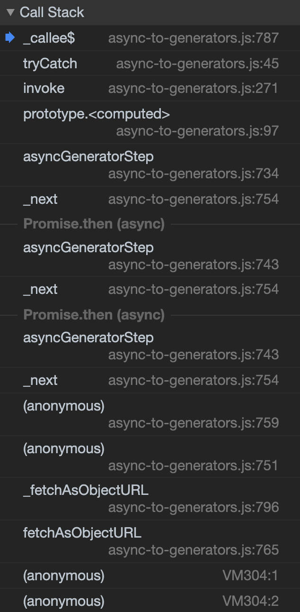
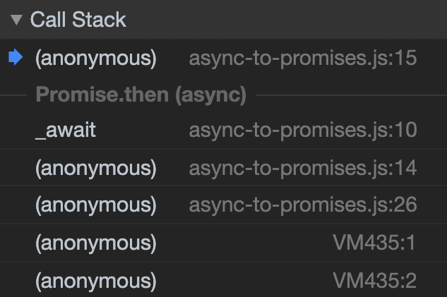

Every time I see this error I have to look it up to figure out what's going on:

```
Uncaught ReferenceError: regeneratorRuntime is not defined
```

The best blog post I've found for fixing this error is by
[Risan Bagja](https://twitter.com/risanbagja):
[Regenerator Runtime is not defined](https://risanb.com/posts/regenerator-runtime-is-not-defined/).
He describes the problem and several solutions really well so feel free to
follow that.

But I'm not super happy with regenerator anyway and would prefer a different
solution.

So, quick review. This error shows up when trying to compile `async/await`
syntax to generators and then finally to state machine functions. Here's an
example of that compilation process:

**Async Input**

```javascript
async function fetchData(url) {
  const response = await fetch(url)
  const json = await response.json()
  return json
}

export default fetchData
```

**Generator Output**

<!-- prettier-ignore -->
```javascript
function asyncGeneratorStep(gen, resolve, reject, _next, _throw, key, arg) {
  try {
    var info = gen[key](arg);
    var value = info.value;
  } catch (error) {
    reject(error);
    return;
  }
  if (info.done) {
    resolve(value);
  } else {
    Promise.resolve(value).then(_next, _throw);
  }
}

function _asyncToGenerator(fn) {
  return function() {
    var self = this,
      args = arguments;
    return new Promise(function(resolve, reject) {
      var gen = fn.apply(self, args);
      function _next(value) {
        asyncGeneratorStep(gen, resolve, reject, _next, _throw, "next", value);
      }
      function _throw(err) {
        asyncGeneratorStep(gen, resolve, reject, _next, _throw, "throw", err);
      }
      _next(undefined);
    });
  };
}

function fetchData(_x) {
  return _fetchData.apply(this, arguments);
}

function _fetchData() {
  _fetchData = _asyncToGenerator(
    /*#__PURE__*/
    regeneratorRuntime.mark(function _callee(url) {
      var response, json;
      return regeneratorRuntime.wrap(function _callee$(_context) {
        while (1)
          switch ((_context.prev = _context.next)) {
            case 0:
              _context.next = 2;
              return fetch(url);

            case 2:
              response = _context.sent;
              _context.next = 5;
              return response.json();

            case 5:
              json = _context.sent;
              return _context.abrupt("return", json);

            case 7:
            case "end":
              return _context.stop();
          }
      }, _callee);
    })
  );
  return _fetchData.apply(this, arguments);
}

export default fetchData;
```

If you look closely, you'll be able to find our bits of code in there. But only
if you look closely. That is super not fun to debug and step through with
debugging tools like the Chrome DevTools.

You may also notice that there's a reference to a variable called
`regeneratorRuntime`. That's supposed to reference the
[regenerator-runtime](https://github.com/facebook/regenerator/tree/master/packages/regenerator-runtime)
module, and the error we're talking about comes up when babel isn't configured
to reference that module properly. To learn how to fix that, feel free to read
through Risan's article referenced above.

But wow, that code looks nothing like what I wrote. When I first discovered that
`async/await` was compiled to generators I was surprised because in my mind,
`async/await` maps way better to promises. So I expected that it would be
compiled to promises. The folks who work on this I'm sure have good reasons for
compiling it to generators, but I would prefer to work with promises if I ever
had to read the compiled output (granted, I don't do that often) or step through
the code with a debugger (I do that all the time!!). For example, here's what
the stack trace looks like if I add a debugger on the `return` line of my code:



Note that most of those lines are not my code and even the lines that are a
result of my code are indistinguishable from the helper code. That's a real pain
to debug.

## Transform `async/await` to promises

Luckily for us, there's a mature babel plugin transform that will compile
`async/await` to promises! It's by [Ryan Petrich](https://twitter.com/rpetrich)
and it's called
[`babel-plugin-transform-async-to-promises`](https://github.com/rpetrich/babel-plugin-transform-async-to-promises).

With that plugin, we can get this output:

<!-- prettier-ignore -->
```javascript
function _await(value, then, direct) {
  if (direct) {
    return then ? then(value) : value;
  }

  if (!value || !value.then) {
    value = Promise.resolve(value);
  }

  return then ? value.then(then) : value;
}

const fetchData = _async(function (url) {
  return _await(fetch(url), function (response) {
    return _await(response.json());
  });
});

function _async(f) {
  return function () {
    for (var args = [], i = 0; i < arguments.length; i++) {
      args[i] = arguments[i];
    }

    try {
      return Promise.resolve(f.apply(this, args));
    } catch (e) {
      return Promise.reject(e);
    }
  };
}

export default fetchData;
```

Now all we need is to make sure we supply a promise polyfill (which we'll
probably be doing anyway) and this code will just work™️. And take a look at
this stack trace!



Way fewer lines in the stack trace and stepping through that in a debugger is
way more straightforward.
