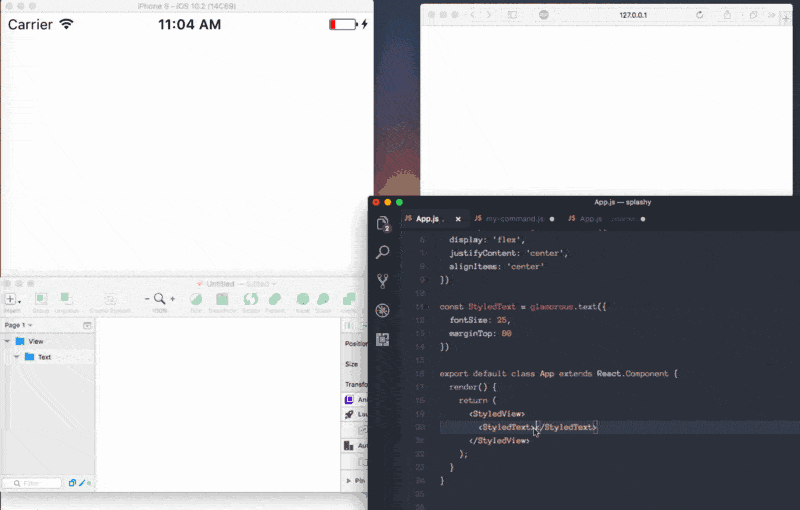
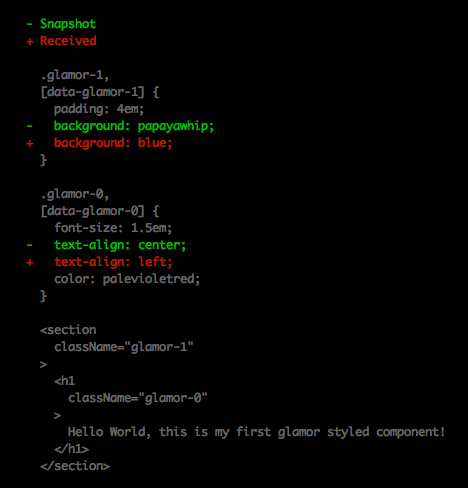

> **_NOTE: glamorous has been deprecated, please use_** >
> [**_emotion_**](https://emotion.sh/) **_as it's smaller, faster, and
> more capable._**

**glamorous v4 has been released with a bunch of new features and performance
enhancements
(**[**glamorous v4 release notes**](https://github.com/paypal/glamorous/releases/tag/v4.0.0)**),
jest-glamor-react v3 has been released
(**[**jest-glamor-react v3 release notes**](https://github.com/kentcdodds/jest-glamor-react/releases/tag/v3.0.0)**),**
[**glamorous-primitives**](https://github.com/nitin42/glamorous-primitives)
**has been released, and the official glamorous website has been released:**
[**https://glamorous.rocks**](https://glamorous.rocks) **(try out**
[**the getting started page**](https://glamorous.rocks/getting-started/)**)!**

[**glamorous - React component styling solved 💄**](https://glamorous.rocks)

### Status update

It's been about 4 months since glamorous was officially released. In that time,
glamorous has received incredible adoption. And the trajectory is looking really
great. We just surpassed 2k stars 🌟 on GitHub
([_have you starred it yet?_](https://github.com/paypal/glamorous/stargazers)).
When
[comparing the similar solutions](http://npmcharts.com/compare/glamorous,styled-components,radium,styled-jsx,styletron,react-jss)
glamorous is soon to be the number 2 most downloaded solution. While download
stats are not a super indicator of the success of open source libraries, I am
excited by the implication that glamorous is at least useful enough for multiple
people to download it more than once 🙃.

More important than the download numbers are the number of
[contributors to the project](https://github.com/paypal/glamorous/blob/master/README.md#contributors).
We have received contributions from many people. There have been over 50 code
contributors on the core GitHub project and 32 code contributors on
[the official website repo](https://github.com/kentcdodds/glamorous-website/blob/master/README.md#contributors).
There are even more people who have reported bugs, reviewed pull requests, and
helped support users on the chat.

_Glamorous is a beginner-friendly open source project with a inclusive code of
conduct and helpful community_ (special shoutout to
[Luke John](https://medium.com/u/94b13791b387) and
[Paul Molluzzo](https://medium.com/u/7d13f7447f6b)). A welcoming and inclusive
open source programming community are important to me, and I hope glamorous
continues down this path.

### What's new in glamorous v4?

#### The new [glamorous.rocks](https://glamorous.rocks) website!!

The glamorous community has been hard at work on
[https://glamorous.rocks](https://glamorous.rocks), the new documentation
website. It's complete with full
[API documentation](https://glamorous.rocks/api/),
[examples from the community](https://glamorous.rocks/examples/), and a great
[getting started guide](https://glamorous.rocks/getting-started/). There's been
a strong effort to localize the website and make it accessible. It's currently
available in 5 languages ([English](https://glamorous.rocks),
[Español](https://es.glamorous.rocks), [Français](https://fr.glamorous.rocks),
[Deutsch](https://de.glamorous.rocks), and [中文](https://zh.glamorous.rocks))
and we'd love
[contributions to make it available in more](https://github.com/kentcdodds/glamorous-website/blob/master/other/CONTRIBUTING_DOCUMENTATION.md#translation)!
I feel that having the documentation in many languages is critical to helping as
many people as possible learn to use and contribute to the project.

#### [`withProps`](https://glamorous.rocks/api)

Sometimes it can be useful to apply props by default for a component. The
simplest way to do this is by simply setting the `defaultProps` value on the
`glamorousComponent`. But if you want a little more power and composition, then
the `withProps` APIs can help.

_These APIs are highly composable, it would be hard to show you all the examples
of how this composes together. Just know that it behaves as you might expect._

```jsx
// when creating a glamorousComponentFactory
const bigDivFactory = glamorous('div', {withProps: {big: true}})
const BigDiv = bigDivFactory(({big}) => ({fontSize: big ? 20 : 10}))
render(<BigDiv />) // renders with fontSize: 20
render(<BigDiv big={false} />) // renders with fontSize: 10

// applying props to an existing component
const MyDiv = glamorous.div(({small}) => ({fontSize: small ? 10 : 20}))
const SmallDiv = MyDiv.withProps({small: true})
render(<SmallDiv />) // renders with fontSize: 10
```

Based on these examples, there are three places you can apply props to a
glamorous component. How these props are composed together applies in this order
(where later has more precedence):

1. Creating a `glamorousComponentFactory`
2. Directly on a `glamorousComponent` with the `.withProps` function
3. When rendering a component (just like applying props to a regular components)

In addition to this, you can also have dynamic props. And these props don't have
to be used for glamorous styling, any valid props will be forwarded to the
element:

```jsx
const BoldDiv = glamorous
  .div(({bold}) => ({fontWeight: bold ? 'bold' : 'normal'}))
  .withProps(({bold}) => ({
    className: bold ? 'bold-element' : 'normal-element',
  }))

render(<BoldDiv />) // renders <div class="bold-element" /> with fontWeight: bold
render(<BoldDiv bold={false} />) // renders <div class="normal-element" /> with fontWeight: normal
```

One cool aspect to this is it allows you to map props to other props as well:

```js
const FormInput = glamorous
  .input({
    /* styles */
  })
  .withProps(props => ({
    pattern: props.creditCard ? creditCardPattern : null,
  }))
```

There's more to this API, so give it a try. I'm sure you'll find it really
powerful.

#### [`propsAreCssOverrides`](https://glamorous.rocks/api)

One API that many people have loved from glamorous is the ability to render
components that are styled without giving those things names like "Wrapper" or
"Container" (inspired by [jsx-style](https://github.com/smyte/jsxstyle)). These
components accept props as css values like so:

```jsx
render(<glamorous.Div marginTop={20} />)
// renders <div /> with margin-top: 20px;
```

However, this only worked with built-in components. With glamorous v4, you can
now get this same behavior for your own components as well:

```jsx
const MyDiv = glamorous('div', {propsAreCssOverrides})({marginTop: 20})
render(<MyDiv marginTop={10} />)
// renders <div /> with margin-top: 10px;
```

You can also compose these kinds of components as well:

```jsx
const MyArticle = glamorous(glamorous.Article)({marginBottom: 10})
render(<MyArticle paddingLeft={20} />)
// renders <article /> with margin-bottom: 10px; padding-left: 20px;
```

I hope that this allows more expressive APIs in the future.

#### [shouldClassNameUpdate](https://glamorous.rocks/api)

Most of the time, [glamor](https://twitter.com/threepointone/glamor) (the
library glamorous uses to generate css) is super fast, but scenarios where the
styles are not dynamic it may be nice to prevent glamor from computing your
styles on each render (and rerender). In these cases, you can implement
`shouldClassNameUpdate` and if the component is rerendered the class name is not
recalculated by glamor. Instead the same class name is reused.

```jsx
const pureDivFactory = glamorous('div', {
  shouldClassNameUpdate(props, previousProps, context, previousContext) {
    // return `true` to update the classname and
    // `false` to skip updating the class name
    return true
  },
})
const Div = pureDivFactory({marginLeft: 1})
render(<Div css={{marginLeft: 2}} />)
// this will render:
// <div />
// with {marginLeft: 2}
```

Note that this is not the same as `shouldComponentUpdate` and your component
will still be rerendered at the appropriate times. `shouldClassNameUpdate`
simply provides a means to opt-out of re-generating the class name
unnecessarily.

#### **Readable Class Names**

With the release of `v2.20.32`, `glamor` introduced the ability to create
readable class names for components by defining a `label` in the style object.
The result is a generated class name with the pattern `css-[label]-[hash]`.

```jsx
// App
const MyRedText = glamorous.div({
  label: 'labelForRedText',
  color: 'red',
})

function App() {
  return <MyRedText>Whoa!</MyRedText>
}

render(<App />, document.getElementById('root'))
// result
// <div tabindex="0" class="css-labelforredtext-1cz491u">Whoa!</div>
```

And if you **use**
[**babel-plugin-glamorous-displayname**](https://github.com/bernard-lin/babel-plugin-glamorous-displayname),
the label will be set automatically! How cool is that!?

#### **Performance Optimizations**

[Kye Hohenberger](https://medium.com/u/93de0780c5e6) found a great optimization
by deferring styles resolution and merging to glamor. Benchmarks are silly so
it's hard to tell how this will impact your app. It really depends on how you
use glamorous. I hardly noticed a difference in my app, but Kye noticed a ~25%
speed increase in mounting of his main App component!

https://twitter.com/kentcdodds/status/890671087847002112

As always, if performance is a real concern of yours, you might also consider
[glamorous-tiny](https://glamorous.rocks/advanced#optimizing-bundle-size).

#### [**glamorous-primitives**](https://github.com/nitin42/glamorous-primitives)

`glamorous-primitives` is an independent library from
[Nitin Tulswani](https://github.com/nitin42) that combines `glamorous` with
[`react-primitives`](https://github.com/lelandrichardson/react-primitives) to
provide a means of writing components that are usable across multiple target
platforms.



Here's the code from that example:

```jsx
import React from 'react'
import 'react-primitives'
import glamorous from 'glamorous-primitives'

const StyledView = glamorous.view({
  display: 'flex',
  justifyContent: 'center',
  alignItems: 'center',
})

const StyledText = glamorous.text({
  fontSize: 25,
  marginTop: 80,
  color: 'pink',
})

export default class App extends React.Component {
  render() {
    return (
      <StyledView>
        <StyledText>💄 glamorous-primitives 💄</StyledText>
      </StyledView>
    )
  }
}
```

glamorous-primitives just hit a stable release and this is only the beginning.
We're really looking forward to what
[glamorous-primitives](https://github.com/nitin42/glamorous-primitives) has to
offer the react ecosystem! Shoutout to
[Nitin Tulswani](https://medium.com/u/9a54dad11779) for this incredible project!
This is just one of the
[related projects](https://github.com/paypal/glamorous#related-projects) the
`glamorous` community has built.

#### [`glamorous-native`](https://github.com/robinpowered/glamorous-native)

`glamorous-native` is a port of `glamorous` that specifically targets React
Native, exporting the same core functionality as `glamorous` as well as built-in
component factories for all React Native elements. It was built and is
maintained by the good folks at [Robin](https://robinpowered.com/) (specifically
[Atticus White](https://medium.com/u/d05c32871122)). For every React Native
element, there is an associated `glamorous` component factory attached to the
`glamorous` function. You can access these factories like so: `glamorous.view`,
`glamorous.text`, `glamorous.listView`, etc.

```jsx
const MyStyledView = glamorous.view({margin: 1})

const ui = <MyStyledView>{content}</MyStyledView>
// rendered output: <View style={{margin: 1}}>{content}</View>
// styles applied: {margin: 1}
// style is also cached and registered with `StyleSheet`
```

This project is actively maintained and has several
[examples](https://github.com/robinpowered/glamorous-native/tree/master/examples)
to learn from if you're interested in trying `glamorous-native` or new to native
development with React Native entirely.

#### TypeScript updates

In addition to support for all the new features and breaking changes announced,
there has been significant improvements to the coverage of existing typing. With
a few exceptions (see the release notes) glamorous should now be fully typed!


<figcaption>Oh my! CSS in JS Autocomplete 😱</figcaption>

Huge thank you to [Luke John](https://medium.com/u/94b13791b387) and others for
all the work they've put into this!

[**_Flow type definitions are coming soon!_**](https://github.com/paypal/glamorous/pull/241)

#### [jest-glamor-react](https://github.com/kentcdodds/jest-glamor-react)

One thing we loved about JSX is it made it even easier for us to test UI because
our HTML is right there with our JS. With CSS-in-JS, we can do that with CSS
too. This is one of the coolest aspects of CSS-in-JS in my eyes.
[jest-glamor-react](https://github.com/kentcdodds/jest-glamor-react) allows you
to take snapshots of react components and include the CSS that would be rendered
with them. It makes finding CSS regressions reasonably possible! And the latest
release makes it even better:



Shoutout to [@jhurley23](https://github.com/jhurley23) for implementing the
[class name placeholder](https://github.com/kentcdodds/jest-glamor-react/pull/12)
making reviewing snapshot changes even easier than before!

#### SWAG! Stickers and T-Shirts

You can purchase
[glamorous stickers](https://www.unixstickers.com/tag/glamorous) from
[UnixStickers.com](https://www.unixstickers.com) to decorate your laptop, desk,
bedroom, and the back of your friends! It comes in two versions:
[Hex](https://www.unixstickers.com/stickers/coding_stickers/glamorous-hexagon-sticker)
and
[square](https://www.unixstickers.com/stickers/coding_stickers/glamorous-square-sticker).
Shoutout to [Connor Elsea](https://medium.com/u/16471d340589) and
[Mark Dalgleish](https://medium.com/u/d7225e72eea) for inspiring the logo! Looks
super awesome on a sticker, trust me!

There are also two shirts available on Amazon from
[GSM Studio](http://amzn.to/2rxvB1T). They each come in multiple colors as well!
And GSM Studio makes a donation of \$1 for every shirt purchased to
[Girls Who Code](https://medium.com/u/7d68e537b225) 🎉
([glamorous Shirt without the name](https://www.amazon.com/dp/B072LV68S2),
[glamorous shirt with the name](https://www.amazon.com/dp/B0714JQW67))


### Breaking Changes

#### Theme arg removed

When we added theming, we decided the way to do it was to add another parameter
to the dynamic styles function arguments:

```js
const MyDynamicallyStyledSpan = glamorous.span((props, theme) => ({
  fontSize: 20,
  color: theme.colors.primary,
}))
```

When we added [`context`](https://glamorous.rocks/advanced/#context) support, we
added it as a third argument. I was disappointed that the dynamic functions
resembled React function component arguments, but not quite.

Later we realized that often you don't need the `props` argument at all and
you're just trying to get to the `theme` argument. It's annoying to have to
include the `props` argument in that case, so we added `theme` to `props`. That
worked great, so I realized we didn't need the `theme` argument anymore. So
that's now been removed!

```js
const MyDynamicallyStyledSpan = glamorous.span(({theme}) => ({
  fontSize: 20,
  color: theme.colors.primary,
}))
```

To make this migration as easy as possible, we've written a
[codemod](https://youtu.be/d0pOgY8__JM) to automatically update your code. It's
already been used by the glamorous website and others to great effect!
[Try out the codemod!](https://github.com/paypal/glamorous/blob/master/other/codemods/README.md)

https://twitter.com/glamorousCSS/status/889999852137992192

#### Config

I've never been a big fan of config for libraries, but we added this config for
`useDisplayNameInClassName` for debugging purposes. As we now have readable
class names, we don't need this anymore and we can remove it! There's no codemod
for this because it should be easier just to do it yourself. Just remove any
instance of `glamorous.config` that you have in your codebase (should only
appear once anyway).

### Conclusion

We're not done making `glamorous` even better (and
[Sunil Pai](https://medium.com/u/e970465f2c1e) isn't done making `glamor` better
either, 🤗🍰).
[Come help us make it better!](https://github.com/paypal/glamorous/blob/master/CONTRIBUTING.md)
We'd especially appreciate
[help on the website and documentation](https://github.com/kentcdodds/glamorous-website/blob/master/other/CONTRIBUTING_DOCUMENTATION.md)
to make it more complete and accessible to more of the world. Together we can
make it easier than ever to build React applications with maintainable CSS.


[See you on twitter! @glamorousCSS](https://twitter.com/glamorousCSS)

**Please share this with your friends and family.** You can share it via
Medium's 💚,
[tweet it yourself](https://twitter.com/intent/tweet?text=Version%204%20of%20@glamorousCSS%20has%20been%20released!%20%F0%9F%92%84%20%F0%9F%8E%89%20%F0%9F%8E%8A%20%20Maintainable%20CSS%20with%20@reactjs%20https://medium.com/@kentcdodds/c678fe02a39a%20by%20@kentcdodds%20%F0%9F%91%8D),
and/or simply retweet this:

https://twitter.com/kentcdodds/status/893133282841247744

**P.S.** Does your company use glamorous?
[Please let us know!](https://github.com/paypal/glamorous/blob/master/other/USERS.md)
Eventually we'll add a `Users` page to the website and we'd love to have users
to put on there.

**P.S.P.S.** PayPal has recently open sourced
[downshift](https://github.com/paypal/downshift): 🏎 Primitives to build simple,
flexible, WAI-ARIA compliant React autocomplete/dropdown/select/combobox
components. Give it a look! I think you'll love it!

**P.S.P.S.P.S.** (I keep on thinking of more things to add). If you're still
unconvinced of the whole css-in-js thing (or your co-workers aren't), then you
may find this helpful:

https://twitter.com/kentcdodds/status/892922536626868224
