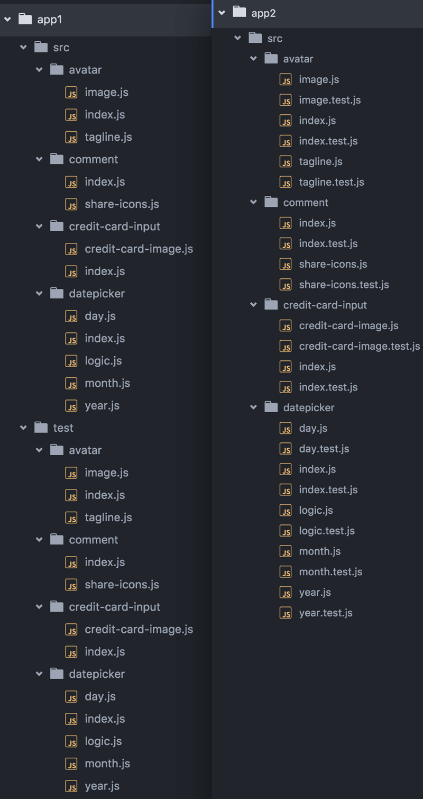

We all need to have codebases that are easy to maintain. Over time, as a
codebase grows, it can become more and more difficult to manage dependencies
(JS, CSS, images, etc.). As projects grow, an increasing amount of your codebase
becomes "tribal knowledge" (knowledge that only you or a few others are privy
to) and this sort of knowledge contributes to "technical debt" (whether that
term is accurate or
[not](https://twitter.com/ryanflorence/status/747983065738153985)).

I like to keep my codebases manageable for not only me (the one who wrote it),
but also my teammates, future maintainers, and myself in 6 months. I think we
can all agree that this is a great ideal that we should strive for in our
codebases. There are a lot of different tools and techniques at our disposal to
accomplish this.

## Where Code Comments Go

One practice that we all exercise on a regular basis is to comment our code. You
explain why you're doing something unexpected in the comments so people coming
after can understand the decisions that were made which resulted in the
unexpected or odd code. We generally "co-locate" these comments with the code
they're explaining by putting it next to or above the code.

The alternative practice to this would be to place those comments in a totally
separate file. A massive "DOCUMENTATION" file or perhaps even a "docs/"
directory that maps back to our "src/" directory. There would be some serious
problems we'd encounter by not co-locating our comments with the code it's
explaining.

- **Maintainability:** They'd get out of sync or out of date quicker (than they
  already do). We'd move or delete a "src/" file without updating the
  corresponding "docs/" file.
- **Applicability:** People looking at the code in "src/" might miss an
  important comment in "docs/" or not comment their own code because they don't
  realize that there's an existing "docs/" file for the "src/" file they're
  editing.
- **Ease of use:** Context switching from one location to the next would be a
  challenge with this kind of a set up as well. Having to deal with multiple
  locations for files could make it difficult to ensure you have everything you
  need to maintain a component.

We could definitely come up with a convention for this kind of code commenting
style, but why would we want to? Isn't it simpler to keep the comments
co-located with the code they're explaining?

## So what?

Now, you're probably thinking to yourself: "Yeah, duh, this is why nobody does
this docs/ thing and everyone just co-locates their comments with the code.
That's obvious. What's your point?" My point is: _co-location translates
wonderfully to other concepts as well._

Take HTML for example. All the benefits of co-locating our comments translate
over to our templates as well. Before Angular, Backbone, etc. (and even still
today to some extent), you'd have your view logic and your view templates in
totally separate directories. This falls prey to the same problems described
above. These days it's far more common to co-locate your HTML template files
with the view logic (JavaScript) files. In fact, with React, you put these
things **in the exact same file.** And it's becoming more common to inline
templates in Angular as well.

This concept of file co-location applies great to unit tests as well. How common
is it to find a project with a "src/" directory and a "test/" directory filled
with unit tests that attempts to mirror the "src/" directory? All the pitfalls
described above apply here as well. I probably wouldn't go as far as putting the
unit tests in the exact same file, but I don't totally rule that out as an
interesting idea either (the implementation is left as an exercise to the
reader).

If I have a "datepicker/logic.js" file, then I'll have
"datepicker/logic.test.js" right next to it. Here's a comparison of the two
approaches:



<figcaption>test/ directory on the left, *.test.js on the right</figcaption>

> To help enable a more maintainable codebase, we should co-locate our unit-test
> files with the file it's testing

This ensures that when new people (or myself in 6 months) come to the code, they
can see immediately that the module is tested and use those tests as a reference
to learn about the module. When they make changes, it reminds them to update
(add/remove/modify) the tests to account for their changes.

Another concept this applies well to is CSS. It is becoming increasingly common
to co-locate your CSS with your JavaScript in the same way that you can with
your HTML. You may have heard of the
[CSS in JS "movement"](http://blog.vjeux.com/2014/javascript/react-css-in-js-nationjs.html)
(⬅ look at that if you haven't seen it yet). The implementation of this with the
fewest trade-offs and the best benefits that I've found is
[**glamor**](https://github.com/threepointone/glamor) (\+
[glamorous](https://glamorous.rocks/) if you use React). I recommend you give it
a look.

This technique can be boiled down to this fundamental principle:

> Place files as close to where they're relevant as possible

You might also say: "Things that change together should be located as close as
reasonable." (Dan Abramov said something like this to me once).

## Open Source made easy(-er)

Aside from avoiding the problems discussed earlier, there are other benefits to
structuring your projects this way. Taking a component and turning it into an
open source project is often as simple as copy/pasting the folder to another
project and publishing that to npm. Then you just install it in your project and
update your require/import statements and you're good to go.

## Tradeoffs/Drawbacks

Some pushback that I normally get from this approach is that it makes your
folders really big. But that's easily resolved (and improved) by following a
reasonable convention. If I have a sizeable component like "datepicker.js" I
often need to break that out into multiple modules to make it easier to test and
think about the code. To make this process easier, I'll create a folder
structure that looks like this:

```
datepicker/
├── day.js
├── index.js
├── logic.js
├── month.js
└── year.js
```

And because of the way that Node (webpack/browserify) resolves modules
(specifically a folder's _index.js_ file), I can simply do:

```js
require('./datepicker') // pointing to the folder
```

And that will resolve to "datepicker/index.js" which will have everything I need
to use the datepicker component.

However, the datepicker component folder grows as we add tests to it:

```
datepicker/
├── day.js
├── day.test.js
├── index.js
├── index.test.js
├── logic.js
├── logic.test.js
├── month.js
├── month.test.js
├── year.js
└── year.test.js
```

Especially if "logic" gets complicated and is split into more files:

```
datepicker/
├── calculate-days-from-today.js
├── calculate-days-from-today.test.js
├── calculate-month-days.js
├── calculate-month-days.test.js
├── day.js
├── day.test.js
├── index.js
├── index.test.js
├── logic.js
├── logic.test.js
├── month.js
├── month.test.js
├── year.js
└── year.test.js
```

To solve this, I'll just make another directory to encapsulate (and co-locate)
the necessary files:

```
datepicker/
├── day.js
├── day.test.js
├── index.js
├── index.test.js
├── logic
│ ├── calculate-days-from-today.js
│ ├── calculate-days-from-today.test.js
│ ├── calculate-month-days.js
│ ├── calculate-month-days.test.js
│ ├── index.js
│ └── index.test.js
├── month.js
├── month.test.js
├── year.js
└── year.test.js
```

And again, because of the way that require statements are resolved, a
_require('./logic')_ will now simply resolve to "./logic/index.js" which can
expose everything needed by the datepicker component.

Although this is a contrived example, I hope it demonstrates a way in which you
can use co-location to your advantage in larger projects.

## Exceptions

Sure there's a good argument for documentation that spans the whole or part of a
system and how things integrate together. And where would you put integration or
end-to-end tests that span across components? _You might think those are
exceptions_, but they can actually subscribe nicely to the principle mentioned
above

If I have a part of my app associated with user authentication and I want to
document that flow, I can put a _README.md_ file in the folder that has all of
the modules associated with user authentication. If I need to write integration
tests for that flow, I could place the file for those tests in that same folder.

For end-to-end tests, those generally make more sense to go at the root of the
project (or potentially even in a different project altogether, though I've
never done it this way). They span beyond the project itself and into other
parts of the system, so it makes sense to me for those to be in a separate
directory. They don't really map to the "src/" files. In fact, E2E tests don't
really care how the "src/" is organized at all. Refactoring and moving around
files in the "src/" directory should not necessitate changing the E2E tests at
all.

## Conclusion

Our goal here is to build software that is as simple to maintain as possible.
The same benefits of **maintainability**, **applicability**, and **ease of use**
we get from co-locating our comments we get by co-location of other things as
well. If you've never tried it out, I recommend you give it a shot.


See you on [twitter](https://twitter.com/kentcdodds)!

P.S. If you're concerned about violating "separation of concerns" I recommend
you check out [this talk](https://youtu.be/x7cQ3mrcKaY) by
[Pete Hunt](https://medium.com/u/3b799f227b58) and re-evaluate what that means
😀.

P.P.S. I should also note that this applies great to images and really any other
resource as well. And when you use a tool like
[webpack](http://webpack.github.io/), co-locating those resources is crazy easy
too.
