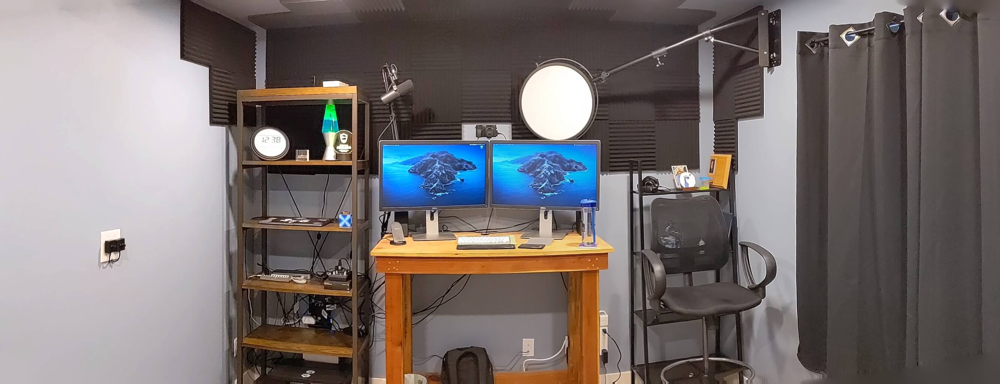

# Uses

I regularly get messages asking about the specifics of some piece of software or
hardware I use. When they do, I send them this page.

> And you can too! The short URL for this page is
> [`kcd.im/uses`](https://kcd.im/uses)

If there is something missing ask in my [AMA](https://kcd.im/ama).

## Editor

- [Visual Studio Code](https://code.visualstudio.com) - Find my settings here:
  [kcd.im/vscode](https://kcd.im/vscode)
- [Night Owl](https://marketplace.visualstudio.com/items?itemName=sdras.night-owl&WT.mc_id=twitter-social-sdras)
  editor theme by [Sarah Drasner](https://twitter.com/sarah_edo)
- [Dank Mono](https://dank.sh) font by
  [Phil Plückthun](https://twitter.com/_philpl)

## Chrome Extensions

- [PaletTab (New Tab Page)](https://palettab.com)
- [1Password extension (desktop app required)](https://chrome.google.com/webstore/detail/1password-extension-deskt/aomjjhallfgjeglblehebfpbcfeobpgk)
- [Contributors on GitHub](https://chrome.google.com/webstore/detail/contributors-on-github/cjbacdldhllelehomkmlniifaojgaeph)
- [GitHub +1s](https://chrome.google.com/webstore/detail/github-%201s/lddfkkebajnpiicnpfamebilmhamkeme)
- [GitHub Repository Size](https://chrome.google.com/webstore/detail/github-repository-size/apnjnioapinblneaedefcnopcjepgkci)
- [OctoLinker](https://chrome.google.com/webstore/detail/octolinker/jlmafbaeoofdegohdhinkhilhclaklkp)
- [Password Alert](https://chrome.google.com/webstore/detail/password-alert/noondiphcddnnabmjcihcjfbhfklnnep)
- [React Developer Tools](https://chrome.google.com/webstore/detail/react-developer-tools/fmkadmapgofadopljbjfkapdkoienihi)
- [Refined GitHub](https://chrome.google.com/webstore/detail/refined-github/hlepfoohegkhhmjieoechaddaejaokhf)
- [Tab Size on GitHub](https://chrome.google.com/webstore/detail/tab-size-on-github/ofjbgncegkdemndciafljngjbdpfmbkn)
- [uBlock Origin](https://chrome.google.com/webstore/detail/ublock-origin/cjpalhdlnbpafiamejdnhcphjbkeiagm)
- [unpkg Link](https://chrome.google.com/webstore/detail/unpkg-link/edafhclpiklopbghoeoefdajoadokdcb)

## Desktop Apps

You can find all the apps I auto-install when I setup a new MacBook in
[my dotfiles `.macos` script](https://github.com/kentcdodds/dotfiles/blob/master/.macos).
Here are a few highlights (in no particular order):

- [Google Chrome](https://www.google.com/chrome)
- [Alfred App](https://www.alfredapp.com)
- [BetterTouchTool](https://folivora.ai)
- [Divvy](https://mizage.com/divvy)
- [Bartender](https://www.macbartender.com)
- [Itsycal](https://www.mowglii.com/itsycal)
- [1Password](https://1password.com)
- [Dash](https://kapeli.com/dash)
- [Terminal.app](<https://en.wikipedia.org/wiki/Terminal_(macOS)>)
- [Spotify](https://spotify.com)
- [Slack](https://slack.com)
- [Discord](https://discord.com)
- [RunCat](https://kyome.io/runcat/index.html)
- [Todoist](https://todoist.com/r/kent_c_dodds_rcfmfh)
- [Workflowy](https://workflowy.com/invite/a9f7933.lnx)
- [Gifski](https://gif.ski)
- [Zoom.us](https://zoom.us)
- [sip](https://sipapp.io)
- [Focus](https://heyfocus.com)
- [Front](https://frontapp.com)
- [Qmoji](https://github.com/jaredly/qmoji)
- [Dropbox](https://dropbox.com)
- [Battery Indicator](https://sindresorhus.com/battery-indicator)
- [ScreenFlow](https://www.telestream.net/screenflow) - Recording software
- [OBS](https://obsproject.com) - Live streaming software
- [RDM](https://github.com/avibrazil/RDM) - For setting the screen size

## CLIs

Again, you can find everything that I auto-install when I setup a new MacBook in
[my dotfiles `.macos` script](https://github.com/kentcdodds/dotfiles/blob/master/.macos).
Here are a few highlights:

- [Homebrew](https://brew.sh/)
- [hub](https://github.com/github/hub)
- [ripgrep](https://github.com/BurntSushi/ripgrep)
- [tree](https://formulae.brew.sh/formula/tree)
- [bat](https://github.com/sharkdp/bat)
- [serve](https://npm.im/serve)
- [diff-so-fancy](https://npm.im/diff-so-fancy)
- [npm-quick-run](https://npm.im/npm-quick-run)
- [npm-check-updates](https://npm.im/npm-check-updates)

## Desk Setup

You can also look at a (pretty bad)
[photosphere of my office on Google Photos](https://photos.app.goo.gl/MeDfjFhfqdnU9Dq38)

You can look at
[a picture of my workplace on twitter](https://twitter.com/kentcdodds/status/1093988761187176448).

- My desk is a custom made standing desk (my wife made it for me for a Christmas
  present) (so sorry, no Amazon link).
- [Homelegance Daria 5-Tier Bookcase, 26" W, Brown](https://smile.amazon.com/dp/B00V4LYKEQ?tag=kentcdodds-20) -
  This is where I put all my auxiliary equipment
- [OWC Thunderbolt 3 Dock](https://smile.amazon.com/gp/product/B07JMH6BSY?tag=kentcdodds-20) -
  is the main box on my bookcase all wires ultimately come together before going
  into my laptop.
- [Cable Matters Thunderbolt 3 Cable](https://smile.amazon.com/dp/B01H5QF2TK/?tag=kentcdodds-20) -
  This connects my laptop to the dock. It's the only cable to goes into my
  laptop.
- [Dell Ultra HD 4k Monitor P2715Q 27-Inch Screen LED-Lit Monitor](https://smile.amazon.com/dp/B00PC9HFO8?tag=kentcdodds-20) -
  I have 2 of these
- [Cable Matters Thunderbolt 3 to Dual DisplayPort Adapter](https://smile.amazon.com/gp/product/B01DYFI1OE?tag=kentcdodds-20) -
  This connects the monitors to the dock.
- [AmazonBasics Mini DisplayPort to DisplayPort Display Cable - 3 Feet](https://smile.amazon.com/dp/B013PWQN1Y/?tag=kentcdodds-20) -
  I have two of these that connect my monitors to the dual DisplayPort adapter.
- [AmazonBasics AA Rechargeable Batteries](https://smile.amazon.com/dp/B007B9NV8Q/?tag=kentcdodds-20) -
  I use this for my wireless keyboard and trackpad.
- [AmazonBasics Ni-MH AA & AAA Battery Charger With USB Port for Rechargeable Batteries](https://smile.amazon.com/dp/B00TOVTZ7K/?tag=kentcdodds-20) -
  How I recharge those batteries.
- [Apple Magic Keyboard](https://smile.amazon.com/dp/B016QO64FI/?tag=kentcdodds-20) -
  This isn't actually the one I have. The one I have is an older edition. But if
  I were buying a new one, this is the one I'd buy.
- [Grifiti Slim Wrist Pad for Apple Wireless Keyboard](https://smile.amazon.com/dp/B00AJE771W/?tag=kentcdodds-20) -
  This goes in front of my keyboard and gives my wrists a little support.
- [Apple Magic Trackpad 2](https://smile.amazon.com/dp/B016QO5YWC/?tag=kentcdodds-20) -
  This isn't actually the one I have. The one I have is an older edition. But if
  I were buying a new one, this is the one I'd buy.
- [Grifiti Slim Wrist Pad for Magic Trackpad](https://smile.amazon.com/dp/B00AJCSIGM/?tag=kentcdodds-20) -
  This goes under my trackpad and gives my wrist a little support.
- [Bose Companion 2 Series III Multimedia Speakers](https://smile.amazon.com/dp/B00CD1PTF0/?tag=kentcdodds-20) -
  My computer speakers that sit on either side of my desk.
- [Mediabridge 3.5mm Male to Male Right Angle Stereo Audio Cable (8 Feet)](https://smile.amazon.com/dp/B00OV41XAM/?tag=kentcdodds-20) -
  This connects my speakers to my dock
- [Audio-Technica ATH-M50x Headphones](https://smile.amazon.com/dp/B00HVLUR86/?tag=kentcdodds-20) -
  I don't use these often (the joys of a home office) but when I do, they're
  fantastic.
- [AUKEY Powered USB Hub](https://smile.amazon.com/dp/B01LRW956O/?tag=kentcdodds-20) -
  I have more USB ports than I know what to do with now. And it's great.
- [Safco Products Vue Mesh Extended-Height Chair 3395BL](https://smile.amazon.com/dp/B003L20OZ0/?tag=kentcdodds-20) -
  This is my chair. It's not terrific, but it's hard to find a chair that it's
  both comfortable and suited for a standing desk. (You'll probably want this
  [Safco Products Loop Arms Set](https://smile.amazon.com/dp/B003L20OZU/?tag=kentcdodds-20))
- [Floortex Cleartex UltiMat Polycarbonate Chair Mat](https://smile.amazon.com/dp/B000V4PPV4/?tag=kentcdodds-20) -
  My chair rolls around on this.
- [Imprint CumulusPRO Commercial Standing Desk Anti-Fatigue Mat](https://smile.amazon.com/dp/B005UA2WO2/?tag=kentcdodds-20) -
  When I'm standing I put this on top of the chair mat. Otherwise I slide it to
  the side of my desk.

### Camera

- [Arkon Camera Wall Mount](https://smile.amazon.com/dp/B00CMLX1O2/?tag=kentcdodds-20) -
  To mount my camera to the wall. This is really awesome.
- [Sony SEL-20F28 E-Mount 20mm F2.8 Prime Fixed Lens](https://smile.amazon.com/dp/B00B20OYUO/?tag=kentcdodds-20) -
  A pancake lens with a nice balance of weight, size, aperture, and angle
- [Sony Alpha a6400 Mirrorless Digital Camera](https://smile.amazon.com/dp/B07VGB9BBH?tag=kentcdodds-20)
- [Sony ACPW20 AC Adaptor](https://smile.amazon.com/dp/B003OBUJD0?tag=kentcdodds-20) -
  Constant power for the camera
- [Blackmagic Design Web Presenter](https://smile.amazon.com/dp/B01N5YEI0O?tag=kentcdodds-20) -
  To make my Sony Camera work like a regular USB Webcam
- [Hosa PWC-143 IEC C13 to NEMA 5-15P Power Cord, 3 Feet](https://smile.amazon.com/dp/B000068OA4/?tag=kentcdodds-20) -
  Power cable for the Blackmagic
- [AmazonBasics USB 2.0 Printer Cable - A-Male to B-Male Cord - 6 Feet](https://smile.amazon.com/dp/B00NH11KIK?tag=kentcdodds-20) -
  Connect the black magic to my computer
- [BlueRigger Micro HDMI to HDMI Cable](https://smile.amazon.com/dp/B0060AU5MW?tag=kentcdodds-20) -
  The HDMI cable to connect the camera to the black magic thing

### Lighting

- [Fotodiox Pro FlapJack Studio LED Light](https://smile.amazon.com/dp/B013TSPWXO/?tag=kentcdodds-20) -
  The light that shines in my face
- [Neewer Triangle Wall Mounting Boom Arm](https://smile.amazon.com/dp/B06XWSFX6D/?tag=kentcdodds-20) -
  This is what I have the light mounted on. I'm able to push the light out of
  the way when I don't need it and I don't have anything cluttering the floor
  making my room nice and clean. I love this.
- [Manfrotto 156BLB 4-Feet Aluminum Mini Kit Stand with 015 Top (Black)](https://smile.amazon.com/dp/B001D2GQ8Y/?tag=kentcdodds-20) -
  The stand I had for the light before I got the wall mount.
- [Draper Silhouette M - 70" H x 96" W Manual Pull-Down Chroma Key Green Screen](https://www.projectorscreenstore.com/Projector-Screens/Draper-Silhouette-M-70-H-x-96-W-Manual-Pull-Down-Green-Screen-AV-Format-Chroma-Key-Green-V20207KG-79035.html) -
  This is my green screen that's mounted to the ceiling.
- [Bladelight (36")](https://www.flolight.com/bladelight-1/) - These light up
  the green screen super well. They're mounted inside the ceiling.

### Microphone

- [Shure SM7B Cardioid Dynamic Microphone](https://smile.amazon.com/dp/B0002E4Z8M/?tag=kentcdodds-20) -
  This is a super nice microphone and gives fantastic quality. I see it in
  professional studios all the time.
- [Heil Sound Microphone Boom](https://smile.amazon.com/dp/B004PJ414I/?tag=kentcdodds-20) -
  This is attached to my desk and reaches over my left monitor to get to my
  face.
- [Cloudlifter](https://smile.amazon.com/dp/B004MQSV04/?tag=kentcdodds-20) -
  Boots the power of my passive microphone. It's silly easy to use.
- [Pyle 2-Channel Audio Mixer](https://smile.amazon.com/dp/B003CY6OHY/?tag=kentcdodds-20) -
  This is the last place my microphone audio goes before it heads into my
  computer.

### Sound Proofing

[Watch me put this together](https://youtu.be/AwLj4qCyJ7E)

- [50 Pack Acoustic Panels 1" X 12" X 12", Black](https://smile.amazon.com/dp/B07VDTR22R/?tag=kentcdodds-20) -
  Attached to cut versions of yard signs
- [10 Blank Signs White 18"x24"](https://smile.amazon.com/dp/B07S952JN9/?tag=kentcdodds-20)
- [Gorilla Glue](https://smile.amazon.com/dp/B07MWRV574/?tag=kentcdodds-20)
- [Command 4 lb White Picture Hanging Strips, Small](https://smile.amazon.com/dp/B007RKFBT6/?tag=kentcdodds-20)
- [VersiFold Acoustical Room Divider](https://www.versare.com/shop/portable-partitions/acoustical-room-dividers/versifold-acoustical-room-divider.html) -
  I don't put this up very often, but I do have it in case I need a little extra
  sound proofing or I want to do a video and not have any distractions behind
  me.

## On the Go

- [KOPACK Lightweight Laptop Backpack](https://smile.amazon.com/dp/B01FFA730Y/?tag=kentcdodds-20) -
  I love this backpack I bought another one as soon as the first was destroyed
  [in a onewheel accident](https://twitter.com/kentcdodds/status/1182010394300170240).
- [Power Bank 20100mAh Portable Charger](https://smile.amazon.com/dp/B00X0GGLWM/?tag=kentcdodds-20) -
  This sits in my backpack and I can charge all my devices with it.
- [USB C Hub Multiport Adapter: Ethernet, HDMI, USB-3 and USB-C](https://smile.amazon.com/dp/B07DW4TFJP/?tag=kentcdodds-20) -
  This stays in my backpack and I use it often when speaking at events or
  visiting people's offices.
- [Kensington Wireless Presenter with Red Laser Pointer](https://smile.amazon.com/dp/B000FPGP4U/?tag=kentcdodds-20) -
  I've had this for years. I don't always use it, but when I need a laser
  pointer/wireless presenter tool, I'm glad I have it!
- [Mini DisplayPort (Thunderbolt) to VGA Adapter](https://smile.amazon.com/dp/B00NH13I08/?tag=kentcdodds-20) -
  Wish I didn't need to just keep this around, but I do.

## Home Stuff

- [Yootech [2 Pack] Wireless Charger](https://smile.amazon.com/dp/B07MSFFDNP/?tag=kentcdodds-20) -
  Where I put my phone on my desk. The other one goes on my nightstand.
- [AmpliFi HD WiFi System by Ubiquiti Labs](https://smile.amazon.com/dp/B01L9O08PW/?tag=kentcdodds-20) -
  This thing gives super fast internet speed, a huge range of connectivity, and
  the range extenders are fantastic. I'll never bother with anything else again.
- [Synology 5 bay NAS DiskStation DS1019+](https://smile.amazon.com/dp/B07NF9XDWG/?tag=kentcdodds-20) -
  I use this to store all of my pictures/movies/music/etc. It's amazing.
- [Seagate IronWolf 3.84TB NAS SSD Internal Solid State Drive](https://smile.amazon.com/dp/B07R1P55GR/?tag=kentcdodds-20) -
  These are phenomenal SSDs for the NAS.
- [CORSAIR FORCE Series MP300 240GB NVMe PCIe M.2 SSD Solid State Storage](https://smile.amazon.com/dp/B07D98DZ38/?tag=kentcdodds-20) -
  I bought two of these when I had the HDDs. Now that I have SSDs I'm not sure
  they're necessary.
- [Seagate IronWolf 10TB NAS Internal Hard Drive HDD](https://smile.amazon.com/dp/B07H241VK4/?tag=kentcdodds-20) -
  The SSDs are _super_ expensive, so if you want a cheaper alternative (and more
  space) get these. I swapped these for the SSDs because they make a little
  mechanical clicking noise as the arms move around the disk and we could
  literally hear it all over the house (we have pretty sensitive hearing) and it
  was keeping us up at night. If you don't think that'll bother you or you have
  a better sound-proofing strategy, then grab these.

## Other

- For my window drapes:
  [Bracket](https://smile.amazon.com/dp/B00069C904/?tag=kentcdodds-20),
  [Light Blocking Curtains](https://smile.amazon.com/dp/B00PF72K38/?tag=kentcdodds-20),
  [Window Curtain Rod](https://smile.amazon.com/dp/B001LTXRDG/?tag=kentcdodds-20)
- [Self Drilling Drywall Plastic Anchors with Screws Kit](https://smile.amazon.com/dp/B01FCZ8I3I/?tag=kentcdodds-20) -
  I used this to mount several of the things on the walls and ceilings in my
  office. They're solid, and you can screw them out if you make a mistake (which
  I wish I could say I've never needed to do).
- [Double Gallery Picture Frame](https://smile.amazon.com/dp/B00EC9RIDW/?tag=kentcdodds-20) -
  Great for the kids to be able to decorate my office without coloring on the
  walls (there's also a
  [single frame](https://smile.amazon.com/dp/B00EC9RIKU/?tag=kentcdodds-20)).

## Old setup

To learn what this page looked like in the past, checkout
[the file history on GitHub](https://github.com/kentcdodds/kentcdodds.com/commits/master/src/pages/uses.mdx)
