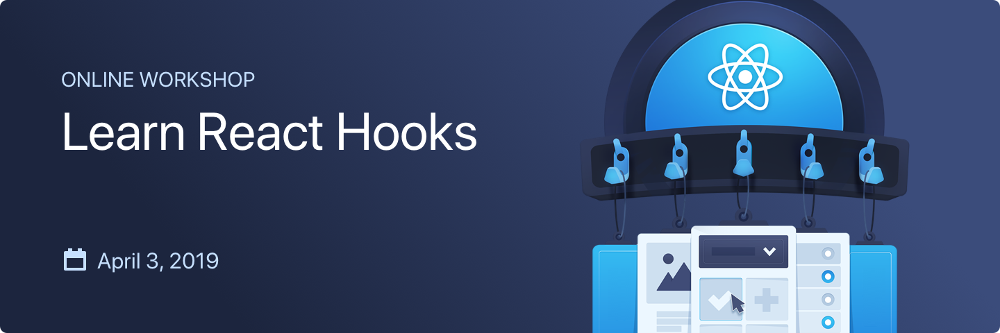

import Check from '../../../components/mdx/Check'
import List from '../../../components/mdx/List'
import CallToAction from '../../../components/CallToAction'

### React is changing. The patterns and practices that you’ve grown accustomed to are being replaced with an entirely new approach to developing components and managing state in your React applications.

 
If you’ve been developing React applications for years, or if you are just
getting started one thing is certain.

You need to learn how to use React Hooks.

Constantly needing to learn new APIs is challenging. Not only do you have
directory after directory of components that are now doomed to be classified as
“legacy”, but you’ve got a whole team that needs to learn these new approaches.

You can continue coding your React components the old way, but the longer you
stick with it, the harder it is going to be to change.

Not to mention Hooks are really really good.

## When you migrate to React Hooks you can:

<List>
  <Check>remove tons of code: you just won’t need it anymore</Check>
  <Check>
    simplify state management: guess what, you probably don’t a library like
    Redux anymore
  </Check>
  <Check>understand your application better</Check>
</List>

Wouldn’t it be nice to skip to the punchline and learn how to start using Hooks
right now?

You can.

In his latest workshop Kent C. Dodds will teach you the ins and outs of React
Hooks. Kent will take you on a deep dive into React Hooks, and show you what you
need to know to start using them in your applications right away.

## When you are done you will:

<List>
  <Check>
    manage state like a pro with useState and useReducer (and know when to
    choose between them.
  </Check>
  <Check>
    Interact with the DOM and simulate class instance variables with useRef and
    useEffect
  </Check>
  <Check>Access context values with useContext</Check>
  <Check>Create custom hooks to organize and reuse component logic</Check>
</List>

<CallToAction
  title="Spots are limited, register today."
  buttonText="Register Now"
  link="https://ti.to/"
>
   
</CallToAction>
